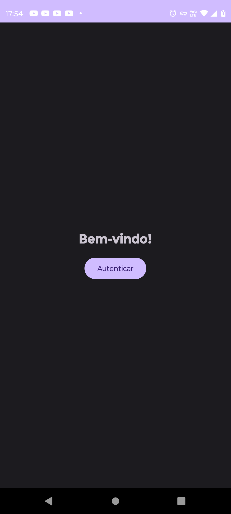
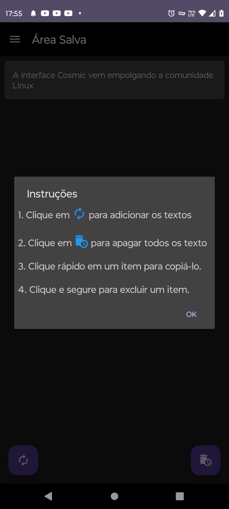

# Área Salva

O **Área Salva** é um aplicativo simples de gerenciamento da área de transferência para dispositivos Android. Ele permite que os usuários coletem e organizem textos copiados para fácil acesso posterior.

## Recursos

- **Monitoramento da Área de Transferência:** O aplicativo monitora a área de transferência do dispositivo para detectar textos copiados.
- **Salvar Textos:** Os textos copiados são salvos automaticamente no aplicativo para referência futura.
- **Excluir Textos:** Os usuários podem excluir itens da lista de textos salvos, mantendo a área de transferência limpa e organizada.
- **Interface Intuitiva:** Uma interface de usuário simples e intuitiva permite uma navegação fácil e rápida.

## Capturas de Tela

## Instalação

1. Faça o download do arquivo APK mais recente do [Área Salva](link_para_download_do_apk).
2. Abra o arquivo APK no seu dispositivo Android.
3. Siga as instruções na tela para concluir a instalação.

## Como Usar

1. Abra o aplicativo **Área Salva** no seu dispositivo Android.
2. Os textos copiados serão exibidos na lista principal.
3. Toque em um item da lista para copiá-lo para a área de transferência novamente.
4. Mantenha pressionado um item da lista para excluí-lo.

## Contribuindo

Contribuições são bem-vindas! Para contribuir com o **Área Salva**, siga estas etapas:

1. Faça um fork do repositório.
2. Crie uma branch para suas alterações (`git checkout -b feature/NomeDaSuaFeature`).
3. Faça commit das suas alterações (`git commit -am 'Adicione uma nova feature'`).
4. Envie a branch para o seu fork (`git push origin feature/NomeDaSuaFeature`).
5. Crie uma pull request para o repositório original.

## Licença

Este projeto está licenciado sob a Licença [MIT](https://www.mit.edu/~amini/LICENSE.md).
